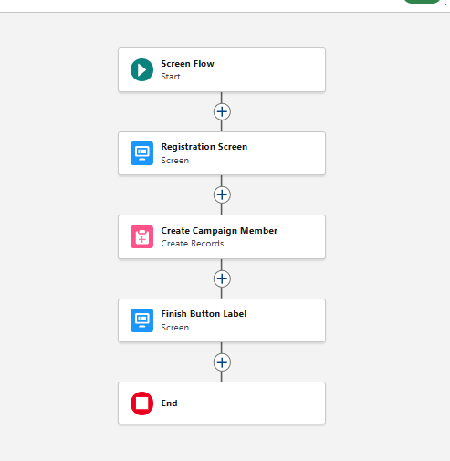

# Event Management System (Capstone Project)

**Program**
TCS Salesforce Last Mile

**Organization**
Gyan Ganga Institute of Technology and Science (GGITS)

**Author**
Shubh Namdeo

**Live Site Link**
https://orgfarm-2d53aa5dc7-dev-ed.develop.my.site.com/s

---

## Project Overview
The Event Hub is a centralized web portal designed to eliminate disorganized manual event registrations. It allows administrators to post campus events and enables students to browse and register instantly using a secure, branded interface. This project focuses on providing a seamless User Experience (UX) while maintaining strict data integrity in the Salesforce backend.

## Problem Statement
Students at GGITS face "registration friction"—the difficulty of creating new accounts and filling out long forms for every campus workshop or sports event. Additionally, without automated capacity tracking, events are often over-registered, leading to poor student experiences. This project solves these issues by providing a one-click registration portal using Google SSO.

---

## Project Visuals

  
   
  <i><b>Figure 1:</b> The Event Hub Student Portal Home Page</i>

 

  
   
  <i><b>Figure 2:</b> Backend Logic - Registration Screen Flow</i>

## Key Features

**One-Click Registration**
I designed a custom Screen Flow that simplifies the user journey. The system automatically identifies the logged-in student, matches them to the event, and creates a registration record without requiring manual data entry.

 

**Google SSO Integration**
To ensure security and ease of access, I integrated Salesforce Auth Providers with Google. This allows students to use their existing college credentials, removing the need for separate password management.

 

**Capacity Management**
The system includes real-time validation logic. Before a registration is finalized, the system checks the total capacity against the number of existing registrants to prevent over-booking.

 

**Automated Confirmations**
Using Salesforce Flow, the system provides instant visual feedback to the student on the screen and triggers an automated email notification with event details.

**Google SSO Integration**
To ensure security and ease of access, I integrated Salesforce Auth Providers with Google. This allows students to use their existing college credentials, removing the need for separate password management.

**Capacity Management**
The system includes real-time validation logic. Before a registration is finalized, the system checks the total capacity against the number of existing registrants to prevent over-booking.

**Automated Confirmations**
Using Salesforce Flow, the system provides instant visual feedback to the student on the screen and triggers an automated email notification with event details.

---

## Technical Architecture
The system is built on the Salesforce Platform using a Model-View-Controller (MVC) architecture to separate the database, logic, and user interface.

### Data Model Strategy
**College Event:** This serves as the Parent object, acting as the primary source of truth for event data including schedules and venues.

**Event Registration:** This is a Junction object that creates a many-to-many relationship between Users and Events, allowing for detailed reporting and tracking.

### Security and Data Privacy
**Organization-Wide Defaults (OWD):** Set to Private for registrations. This architecture ensures that a student can only view their own registration history, maintaining strict data privacy.

**Field Level Security:** I configured profiles to ensure that while students can discover events, only authorized coordinators have the permission to modify event details or delete records.

### Technology Stack
**Frontend:** Salesforce Experience Cloud (LWR/Aura templates)

**Backend Automation:** Salesforce Flow Builder

**Identity:** Salesforce Auth Provider (Google SSO)

**Database:** Salesforce Custom Objects and SOQL

---

## Repository Structure
**force-app/main/default/objects:** Metadata definitions for the custom schema.

**force-app/main/default/flows:** XML source code for the registration and validation logic.

**force-app/main/default/permissionsets:** Access control configurations for different user personas.

---

## Contact
**LinkedIn:** [https://www.linkedin.com/in/shubh-namdeo-8a9902186](https://www.linkedin.com/in/shubh-namdeo-8a9902186)
